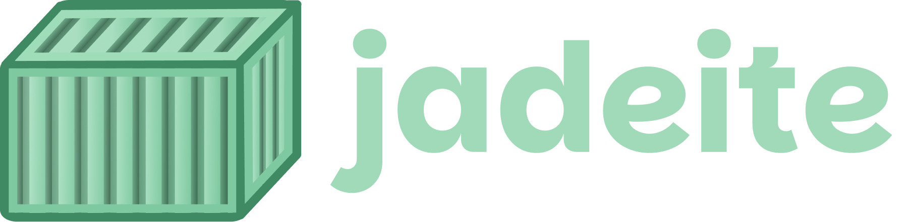

  

jadeite is an experimental ultralite container host based on hadron and kairos. kinda like balenaos but good.

## you pawbably shouldn't use this

jadeite is new and experimental, as is hadron. bluntly this is very scuffed, know what you're doing first.

## real docs coming soon (i promise)
### no claude was used in the production of this *ite thing

  

コンテナ大好きすぎる！Podmanのアザラシ超かわいい！！！[お願い、GitHub Sponsorsでお金ちょうだい！](https://github.com/sponsors/nothingneko/)
